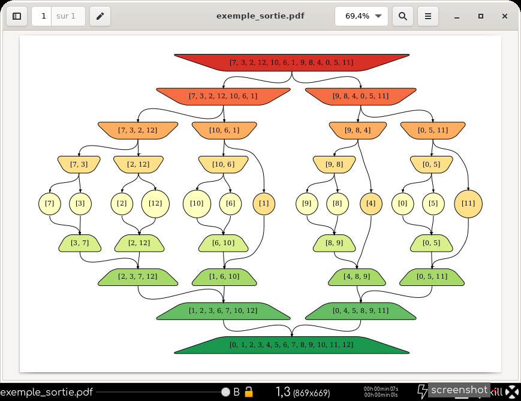
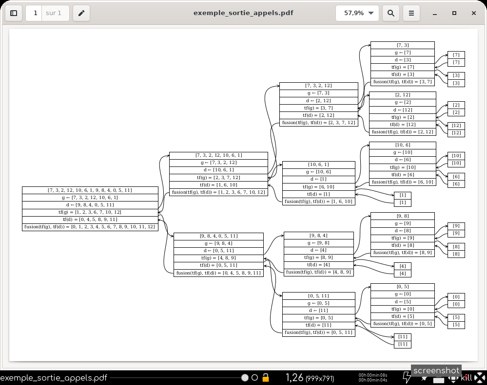
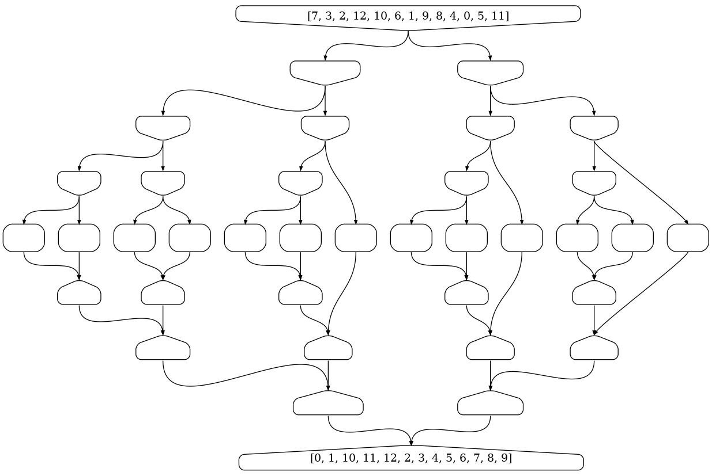
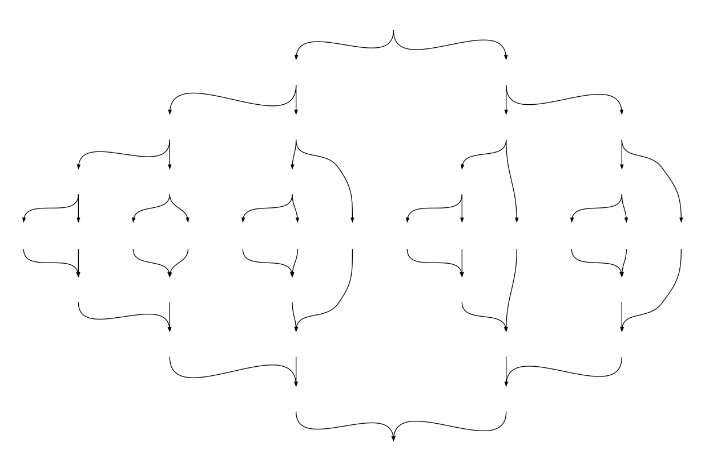

# trifusionviz

## Installation via [Pypi.org](https://pypi.org/project/trifusionviz/)

``` bash
$ pip3 install trifusionviz
```

## Utilisation en ligne de commande

L'installation fournit la commande `tfv`

``` python
$ ./tfv -h
usage: tfv [-h] [-nb] [-al] [-ft [FORMAT]] [-fo [FONCTIONORDRE]]
           [liste] [fichier]

Application facilitant l'utilisation de trifusionviz

positional arguments:
  liste                 liste Python avec guillemets
  fichier               nom du fichier de sortie

optional arguments:
  -h, --help            show this help message and exit
  -nb, --noirblanc      Noir et Blanc
  -al, --appels         sortie des appels
  -ft [FORMAT], --format [FORMAT]
                        format fichier, par défaut : pdf
  -fo [FONCTIONORDRE], --fonctionordre [FONCTIONORDRE]
                        par défaut : lambda x, y: x < y

```

### Exemples :

- `$ tfv "[1, 4, 3, 2]" test -ft png` créera un fichier `test.png`

- `$ tfv -nb -al "[1, 4, 3, 2]" test` créera deux fichiers en noir et blanc : `test.pdf` et `test_appels.pdf`

- `$ tfv "[1, 4, 10, 2]" test -fo "lambda x, y: str(x) < str(y)"` créera  un fichier : `test.pdf`

### Remarques :

- Sans argument, `tfv` produit une erreur.

- Avec une liste pour seul argument, par exemple `$ tfv "[1, 5, 2]"`, cela produit dans le répertoire courant un fichier
`Digraph.gv.pdf`.

- `tfv` n'implémente pas pour le moment toutes les fonctionnalités
  de la bibliothèque.

## Utilisation en module

``` python
import trifusionviz as tfv
import random

liste = list(range(13))
random.shuffle(liste)

t = tfv.trifusionviz(liste)
# sorties pdf : graphe et appels
t.sortie_appels = True
t.sortie("exemple_sortie")

u = tfv.trifusionviz(liste)
u.fonction_ordre = lambda x, y: str(x) < str(y)
u.noirblanc = True
u.profondeurs_cachees = range(2, 2 + 7)
u.forme_diviser, u.forme_arreter, u.forme_combiner = \
    "invhouse", "rectangle", "house"
# sortie png
u.sortie("exemple_sortie_lexico", "png")

v = tfv.trifusionviz(range(13))
v.style = "invis"
# sortie png
v.sortie("exemple_invisible", "png")

```

## Sorties de l'exemple









## Licence
CC-BY-NC-SA
