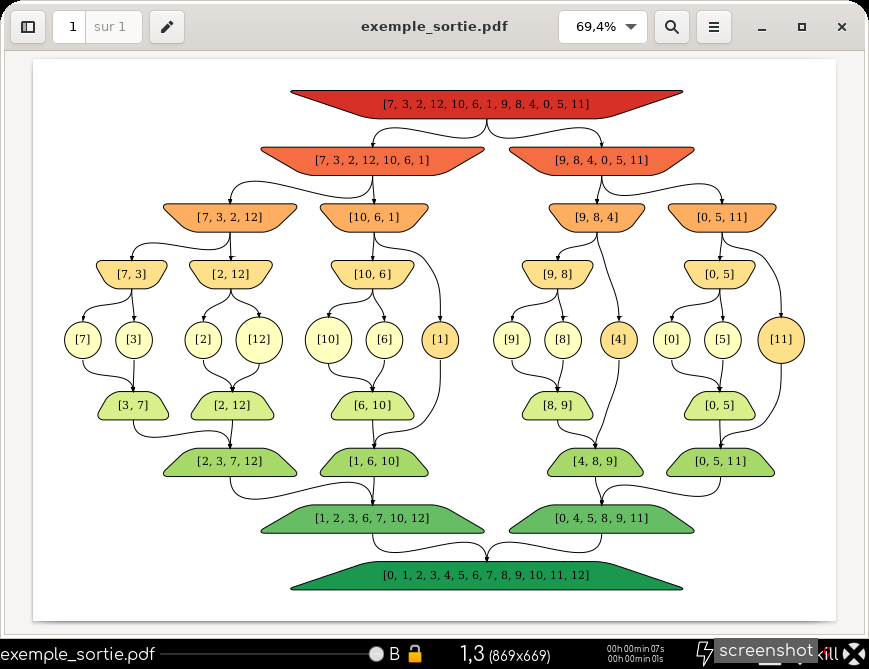
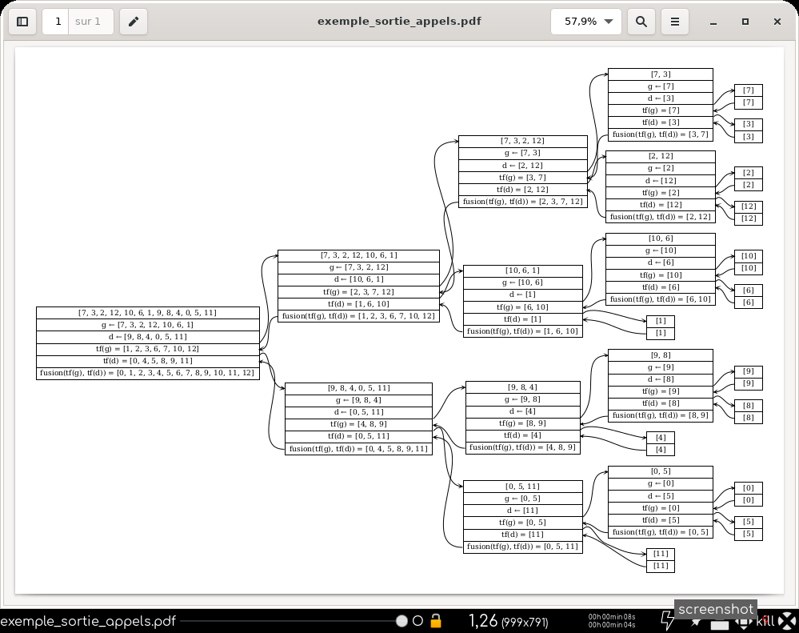
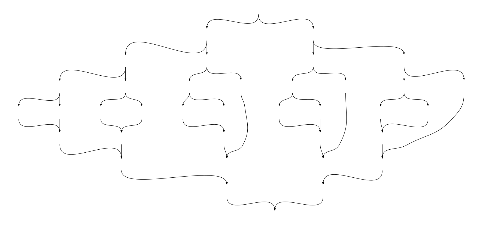

# trifusionviz

## Installation via [Pypi.org](https://pypi.org/project/trifusionviz/)

``` bash
$ pip3 install trifusionviz
```

## Usage

``` python
import trifusionviz as tfv
import random

liste = list(range(13))
random.shuffle(liste)

t = tfv.trifusionviz(liste)
# sorties pdf : graphe et appels
t.sortie_appels = True
t.sortie("exemple_sortie")

u = tfv.trifusionviz(liste)
u.fonction_ordre = lambda x, y: str(x) < str(y)
u.noirblanc = True
u.profondeurs_cachees = range(2, 2 + 7)
u.forme_diviser, u.forme_arreter, u.forme_combiner = \
    "invhouse", "rectangle", "house"
# sortie png
u.sortie("exemple_sortie_lexico", "png")

v = tfv.trifusionviz(range(13))
v.style = "invis"
# sortie png
v.sortie("exemple_invisible", "png")

```

## Sorties de l'exemple








## Licence
CC-BY-NC-SA
